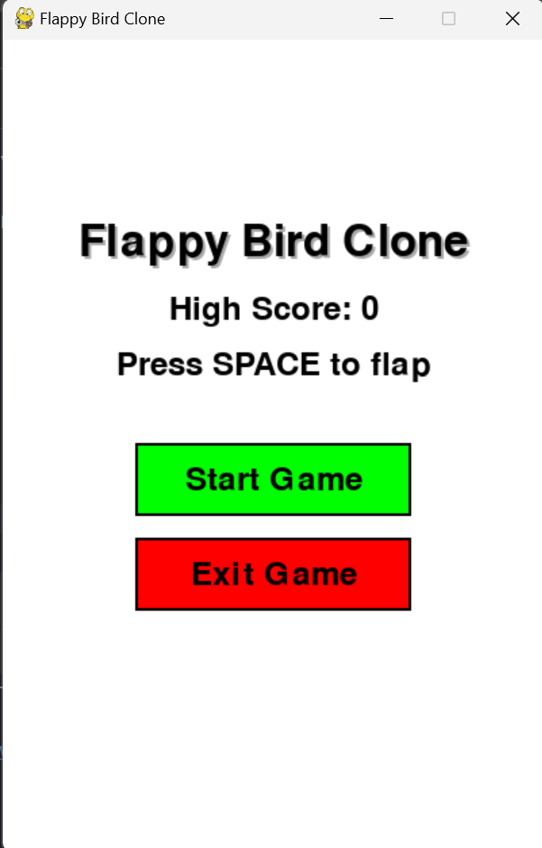
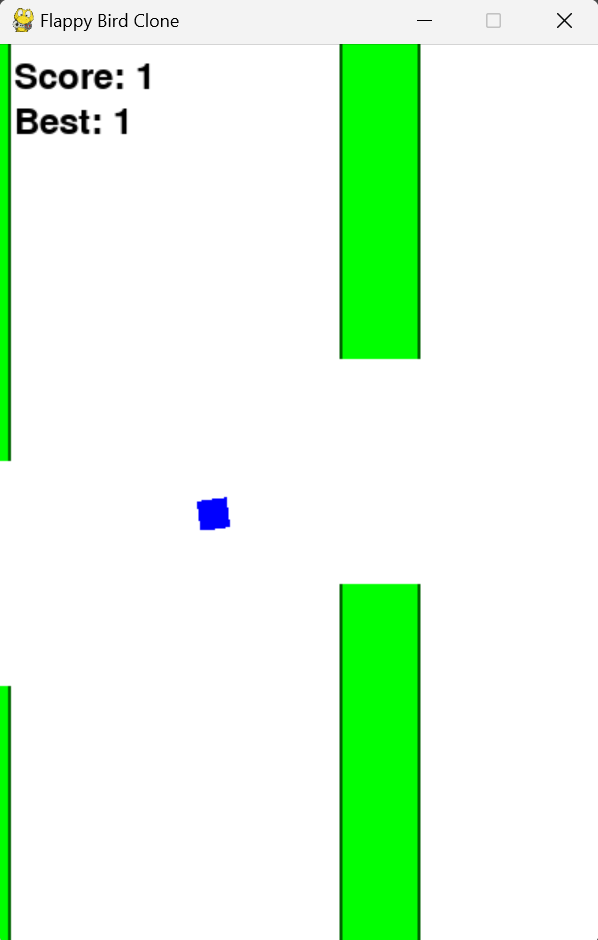
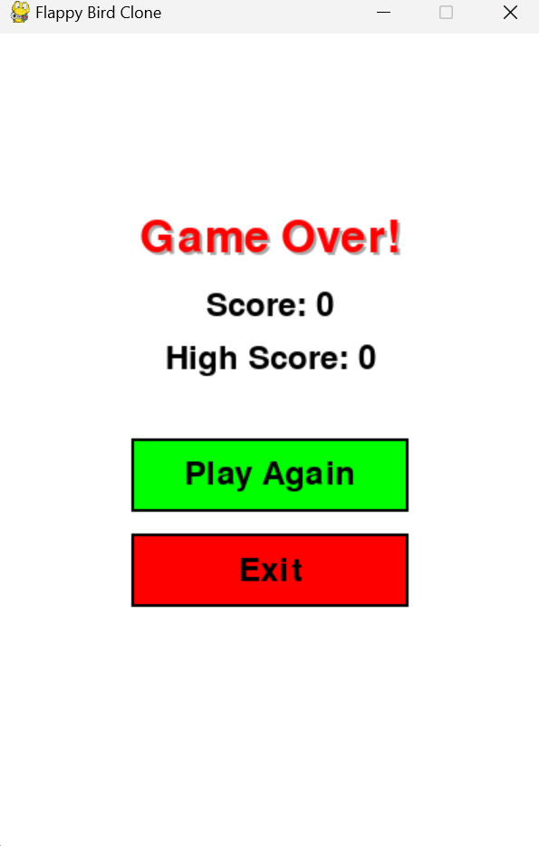

# Bird Game

## Game Overview

This Project is a clone of the popular mobile game Flappy Bird, where the player controls a bird, attempting to navigate through pairs of pipes without hitting them. This version includes:

## How to Play

- Navigate the bird through the gaps between pipes.(press space to flap)
- Avoid touching the pipes or the ground.
- Score points by passing through each set of pipes.

## Installation

### Requirements

- Python 3.x
- Pygame (install with `pip install pygame`)

## Output

