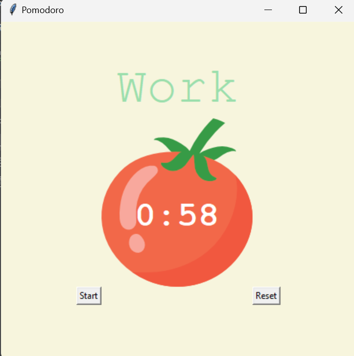

# Pomodoro Timer

## Description
The Pomodoro Timer is a simple application built using Python's Tkinter library. It implements the Pomodoro technique, which helps users manage their time effectively by alternating between work sessions and short breaks.

## Features
- Timer that counts down work sessions and breaks.
- User-friendly graphical interface.
- Visual feedback with check marks for completed work sessions.

## How to Use
1. Click the "Start" button to begin a work session.
2. The timer will count down, and when the session ends, a break will start.
3. Click the "Reset" button to stop the timer and reset it to zero.

## Output Image

## Installation
To run this application, ensure you have Python installed on your machine. You can run the application by executing the `main.py` file.

