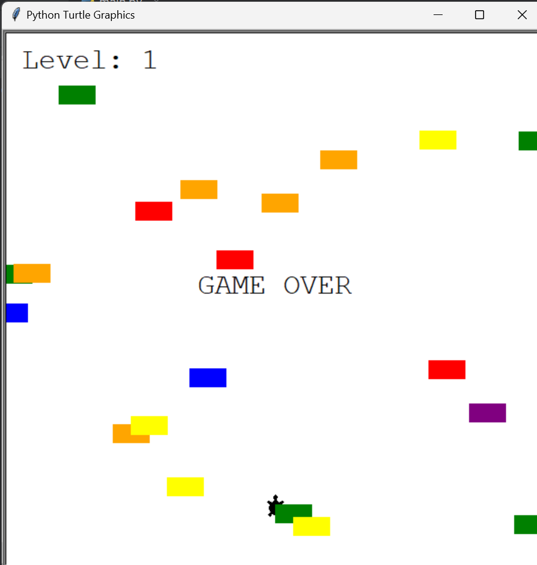

# Turtle Crossing Game

## Description
The Turtle Crossing project is a simple game where the player controls a turtle that must cross a road filled with moving cars. The player moves up to reach the finish line while avoiding collisions with the cars.

## How to Play
- Use the "Up" arrow key to move the turtle forward.
- Avoid the cars that are moving towards you.
- Reach the finish line to increase your level.

## Features
- Increasing difficulty as the player progresses.
- Scoreboard that displays the current level.
- Game over screen when the player collides with a car.

## Installation Instructions
1. Clone the repository to your local machine.
2. Navigate to the `Turtle_Crossing` directory.
3. Run the game using Python.

## Output Images

