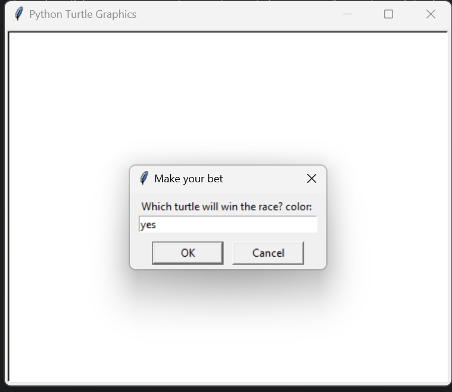
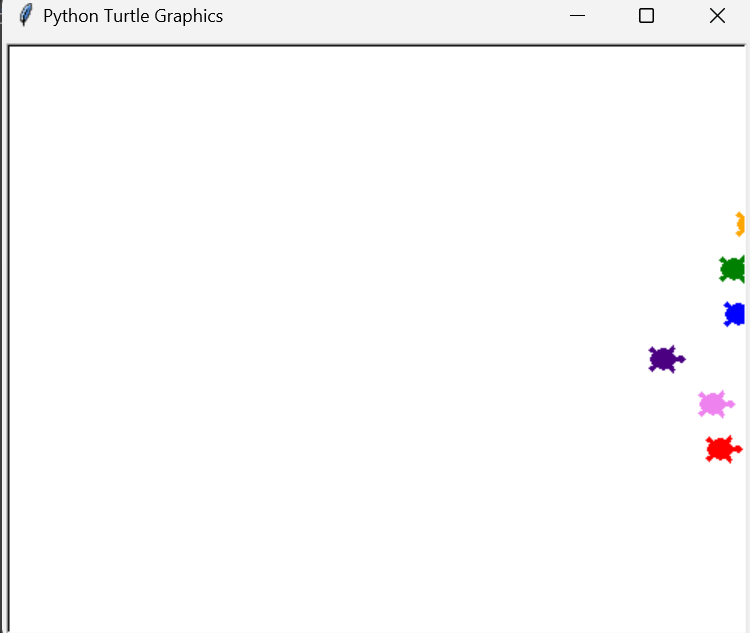

# Turtle Race Game

## Description
The Turtle Race Game is an interactive game where players can place bets on which turtle will win a race. The game features colorful turtles racing across the screen, and players can enjoy the excitement of watching the race unfold.

## How to Play
1. Run the game.
2. When prompted, enter the color of the turtle you think will win the race.
3. Watch the turtles race across the screen!
4. The game will announce whether you have won or lost based on your bet.

## Requirements
- Python 3.x
- `turtle` module (included with Python)

## Installation Instructions
1. Ensure you have Python installed on your computer.
2. Clone the repository or download the game files.
3. Navigate to the `Turtle_Game` directory.
4. Run the game using the command: `python Turtle_game.py`

## Game interface

