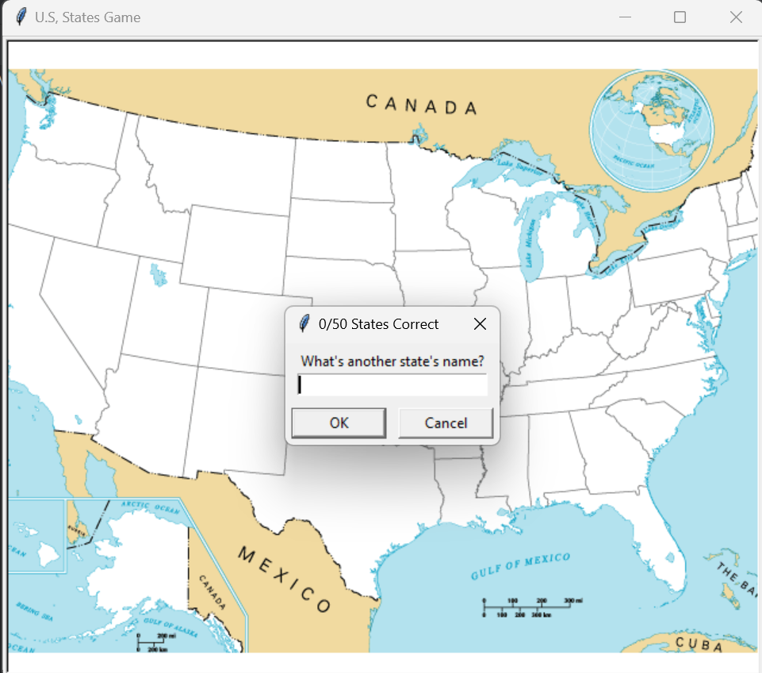
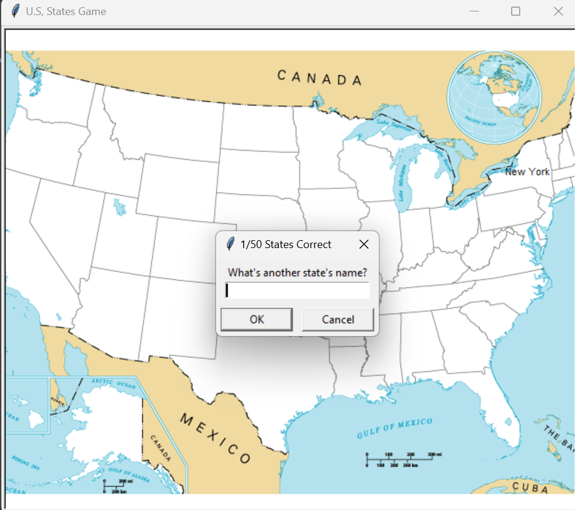

# States-Guessing-Game
This Code is purely written in Python. This code uses pandas and turtle libraries. This game's main goal is to remember states of a particular nation
with an idea on their geographical location. It gives scores based on the answer given. It Provides Graphical User Interface to the user. 
User can see his/her score. When correct answer is given then the name of that particular states appears on the geographical location of the map. By making this 
feature user can remember states name.

## Before writing correct state name

## After writing correct state name

